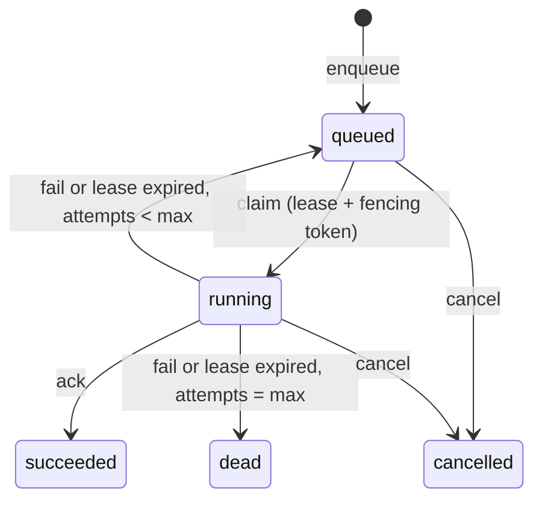

# pgqueue

A durable job queue built on a single PostgreSQL table, with a FastAPI HTTP API
for producers and a Python worker library. Producers enqueue jobs with a
priority, an optional delay and an optional idempotency key; workers claim jobs
with `SELECT ... FOR UPDATE SKIP LOCKED` plus a time-limited lease that a
heartbeat keeps alive, then ack or fail them. Failures retry with exponential
backoff and jitter and are dead-lettered after `max_attempts`; a reaper returns
jobs from crashed workers to the queue. I built it to understand what "durable"
and "at-least-once" mean in practice, so the repo includes a test that kills
workers mid-job, a test that restarts the database under load, and a benchmark
that shows why `SKIP LOCKED` matters.

## Results

All numbers below come from scripts in `bench/`; the raw output is in
[`results/`](results/).

**Hardware and setup.** Laptop with an Intel i9-14900HX (32 logical CPUs),
Windows 11, Python 3.13.7, PostgreSQL 18.4 embedded via `pixeltable-pgserver`
(default settings: `fsync=on`, `synchronous_commit=on`, `shared_buffers=128MB`),
database and workers on the same machine over TCP loopback. Other workloads
were running on the laptop at the same time, so absolute numbers are noisy; the
per-run spread is in `results/benchmark.json`. CI and docker-compose use
PostgreSQL 16.

### Throughput: SKIP LOCKED vs plain FOR UPDATE

`python -m bench.benchmark`: 5000 pre-loaded no-op jobs, N worker processes
released together from a barrier, rate measured from the first claim to the
last ack using database timestamps. Median of 5 runs (min to max in
parentheses).

| Worker processes | `FOR UPDATE SKIP LOCKED` (jobs/s) | plain `FOR UPDATE` (jobs/s) |
|---:|---:|---:|
| 1  | 206.7 (202.9 to 209.8)   | 204.4 (202.3 to 210.2)  |
| 2  | 415.3 (408.1 to 513.4)   | 412.0 (406.7 to 423.0)  |
| 4  | 970.9 (799.5 to 1036.1)  | 777.9 (726.4 to 786.0)  |
| 8  | 1485.5 (1424.7 to 1511.4) | 1062.7 (898.7 to 1091.5) |
| 16 | 2035.8 (1936.0 to 2091.5) | 977.5 (865.1 to 1052.6) |
| 32 | 2441.3 (2382.6 to 2883.9) | 842.2 (832.8 to 872.7)  |


At 1 and 2 workers the two modes are the same within noise: with so few
claimers, a claimer rarely finds the head row locked, and when it does the wait
is one short transaction. At 4 workers SKIP LOCKED was ahead in this run
(median 971 vs 778 jobs/s), but in an earlier run of the same benchmark (3
repeats, `results/benchmark.json` at commit `2dc385f`) plain `FOR UPDATE` was
ahead at 4 workers (850 vs 729 jobs/s), so I do not read anything into the
4-worker difference. From 8 workers on the result was the same in both runs:
plain `FOR UPDATE` peaks at about 1000 jobs/s and then declines (842 jobs/s at
32 workers), while SKIP LOCKED keeps climbing to 2441 jobs/s at 32 workers, 2.9
times as much. With a plain `FOR UPDATE`, every claimer tries to lock the same
head-of-queue row and waits until the holder's claim transaction commits before
moving on to the next row, so claims are effectively serialized and adding
workers only adds waiting. SKIP LOCKED lets each claimer take the next unlocked
row immediately.

Each job costs two short transactions (claim, ack), each with a WAL flush.
Each of those also checks out a pooled connection, and the pool validates the
connection on checkout (one extra round trip), so a job is about four round
trips plus starting and joining a heartbeat thread. These numbers measure that
queue overhead, not a realistic workload.

### Enqueue-to-start latency

One producer enqueues 1000 jobs at a fixed 100 jobs/s; workers poll every
50 ms when idle. Latency is the first claim time minus the time the job became
runnable, `GREATEST(run_at, enqueued_at)` (for these undelayed jobs, the
enqueue time), both read from the database clock.

| Worker processes | p50 (ms) | p95 (ms) | p99 (ms) |
|---:|---:|---:|---:|
| 1  | 29.18 | 54.56 | 60.42 |
| 2  | 23.81 | 50.30 | 57.91 |
| 4  | 21.09 | 50.04 | 52.64 |
| 8  | 13.12 | 48.55 | 51.23 |
| 16 | 16.59 | 50.14 | 51.33 |
| 32 | 10.40 | 40.47 | 44.11 |

(SKIP LOCKED mode.) At this rate the workers are mostly idle, so latency comes
mostly from the 50 ms poll interval: with more workers polling, a new job
usually waits less for the next poll, though not monotonically (16 workers had
a higher p50 than 8 in this run). The two claim modes give similar latency at
this load (both are in the JSON).

### Crash safety (worker processes killed mid-job)

`python -m bench.crash`: 1000 jobs, 6 worker processes, lease 1 s. Every
0.3 s a random worker gets `SIGKILL` (`TerminateProcess` on Windows) and a
replacement starts. Each handler records a delivery row before doing its
10 to 50 ms of work.

| Metric | Run 1 (`crash_test.json`) | Run 2 (`crash_test_run2.json`) |
|---|---:|---:|
| Workers killed | 30 | 30 |
| ...of which were holding a job (approximate, see below) | 20 | 19 |
| Jobs succeeded | 1000 / 1000 | 1000 / 1000 |
| Jobs never delivered | 0 | 0 |
| Duplicate deliveries (handler ran more than once) | 19 (1.9%) | 18 (1.8%) |
| Most deliveries of one job | 2 | 3 |
| Failed attempts recorded (expired leases) | 19 | 20 |
| Wall time | 11.25 s | 11.19 s |

No job was lost in either run, and about 2% of jobs ran more than once, which
at-least-once delivery allows. The two runs used the same arguments and seed;
the seed only picks which worker to kill, and timing decides the rest, so the
runs are not deterministic. "Holding a job" is sampled with a query just
before each kill, so a worker can finish or claim a job between that query and
the kill; the number is close to, but not exactly, the number of interrupted
jobs. A smaller version of this test (150 jobs, 5 kills) runs in `pytest` and
in CI, and fails if no lease expired (that is, if no kill hit a busy worker).

### Database restart under load

`python -m bench.restart`: 500 jobs, 4 workers, lease 5 s. Once 30% of the
jobs had succeeded (151 succeeded and 4 running at that point), the server was
restarted with `pg_ctl restart -m fast` (disconnects all sessions and aborts
open transactions). The database accepted connections again 0.80 s after the
restart began, and all 500 jobs had succeeded 3.69 s after it began.

| Metric | Value |
|---|---:|
| Jobs succeeded | 500 / 500 |
| Handler invocations | 504 |
| Delivery rows recorded | 500 (one per job) |
| Failed attempts | 4 |

The 4 extra invocations failed before doing any work. The test handler records
its delivery row over its own plain connection; that connection broke in the
restart, so the first job each of the 4 workers ran afterwards raised
`OperationalError` on that INSERT, was recorded as a failed attempt, and was
retried. So no job had its side effect applied twice in this run, but that is
a property of when the restart happened, not a guarantee: if an ack is lost in
a restart, the job runs again (see the failure table below). The workers' own
queue calls did not fail, because the connection pool waits (up to its 30 s
timeout) for a new connection while the server is down. CI runs the same test
on every push against the Postgres service container, restarted with
`docker restart`.

## Guarantees and failure modes

- **Durability.** A job exists once `POST /jobs` returns: the response is sent
  after the INSERT commits. Every state change is a committed UPDATE, so
  anything acknowledged survives a crash or restart of PostgreSQL (with the
  default `fsync=on`, `synchronous_commit=on`).
- **At-least-once delivery, not exactly-once.** A job can run more than once:
  when a worker dies after its handler has side effects but before the ack
  commits, or when an ack cannot reach the database. Handlers with side
  effects should be idempotent (`job.id` works as a dedupe key).
- **At most one valid lease.** At any moment at most one worker holds a valid
  lease on a job. Each claim issues a new `lease_token`, and ack, fail and
  heartbeat only succeed if the token matches, so a worker whose lease was
  reaped cannot overwrite the result of the attempt that replaced it. This
  fences the outcome, not the execution: a stalled worker's handler may still
  be running at the same time as the new attempt.
- **Ordering.** Claims go by `priority DESC, run_at, id`. That is best-effort
  ordering, not strict FIFO: concurrent workers finish in any order, and
  retries go back into the queue.

What happens when things break:

| Event | What happens |
|---|---|
| Worker process crashes or is killed | Its open transaction is rolled back by PostgreSQL. A job it had claimed stays `running` until the lease expires; the reaper (every worker runs it every 5 s by default) then puts it back to `queued` and counts a failed attempt. |
| Worker stalls (long GC pause, network partition) | Same as a crash once the lease expires and a reaper has re-queued the job. If the worker wakes up after that, its ack is rejected by the fencing token and its result is discarded. (If it wakes up after the lease expired but before any reaper ran, its ack still succeeds; it was still the only holder.) |
| Handler raises | The attempt fails; the job is retried after `base * 2^(attempt-1)` seconds (capped), half fixed and half random jitter. |
| Handler returns a value PostgreSQL cannot store (not JSON-serializable, NaN/Infinity, NUL characters) | Checked before the ack and treated as a failed attempt, like an exception. Any other error the database raises while recording an outcome is also recorded as a failed attempt instead of stopping the worker. |
| Job keeps failing, or keeps crashing its worker | After `max_attempts` failed attempts (handler errors and expired leases both count) it moves to `dead` and stays there. |
| Database restarts | Committed jobs are intact. Claims that were in flight roll back (the job stays `queued`). The pool checks connections on checkout, replaces dead ones, and makes worker calls wait up to 30 s for a new one (the API waits 5 s, and `/healthz` answers 503 after 2 s). Errors that still surface (a connection dropped mid-query, or the pool timeout) make the worker back off, up to 10 s, and try again. If an ack is lost this way, the job stays `running` until its lease expires and then runs again. |
| Worker receives SIGTERM or SIGINT | It finishes the job it is running, acks it, and exits without claiming another (`tests/test_shutdown.py`, Linux only; on Windows, terminating a process does not run signal handlers). |
| Job cancelled while running | The job moves to `cancelled` and its lease is revoked. The handler keeps running (Python cannot interrupt it safely), but its ack is rejected and the job is not retried. |
| Two producers enqueue with the same idempotency key | One row is inserted; both calls get the same job (201 for the first, 200 for the duplicate). |

## Architecture

```
producers ── HTTP ──> FastAPI app (api.py) ──┐
                                             │   one SQL statement per state
worker processes (worker.py) ────────────────┤   transition (queue.py)
  claim -> run handler -> ack / fail         │
  heartbeat thread extends the lease         v
  reaper re-queues expired leases      PostgreSQL: jobs table
```



| Path | Contents |
|---|---|
| `src/pgqueue/migrations/001_create_jobs.sql` | Schema: jobs table, partial indexes for claiming and reaping, idempotency unique index |
| `src/pgqueue/queue.py` | `Queue`: enqueue, claim, heartbeat, ack, fail, cancel, reap, metrics queries |
| `src/pgqueue/worker.py` | `Worker`: poll loop, heartbeat thread, error handling |
| `src/pgqueue/api.py` | FastAPI app |
| `src/pgqueue/metrics.py` | Prometheus text rendering |
| `src/pgqueue/db.py` | SQL-file migration runner (advisory lock, one transaction per file) |
| `bench/` | Crash test, restart test, benchmark, plot, embedded-Postgres helper |

HTTP API:

| Method and path | Description |
|---|---|
| `POST /jobs` | Enqueue. Body: `task`, `payload`, `queue`, `priority`, `delay_seconds` or `run_at`, `idempotency_key`, `max_attempts`. 201 created, 200 if the idempotency key already exists. |
| `GET /jobs/{id}` | Job status, attempts, last error, result |
| `POST /jobs/{id}/cancel` | Cancel a queued or running job (409 if already finished) |
| `GET /metrics` | `pgqueue_jobs{queue,state}` gauge, `pgqueue_jobs_completed_total`, `pgqueue_job_failures_total`, `pgqueue_enqueue_to_start_seconds` histogram (measured from when the job became runnable: the enqueue time, or `run_at` for delayed jobs). All values come from one database snapshot. |
| `GET /healthz` | Database connectivity check (503 if the database is unreachable within 2 s) |

## Quickstart

With Docker (PostgreSQL 16, the API, and two workers running `examples/tasks.py`):

```bash
docker compose up --build
curl -X POST localhost:8000/jobs -H 'content-type: application/json' \
     -d '{"task": "echo", "payload": {"hello": "world"}}'
curl localhost:8000/jobs/1
curl localhost:8000/metrics
```

Without Docker, using the embedded PostgreSQL from `pixeltable-pgserver`
(bash, including Git Bash on Windows):

```bash
python -m venv .venv && source .venv/bin/activate    # Git Bash: source .venv/Scripts/activate
pip install -e ".[dev,local]"
export DATABASE_URL=$(python -m bench.localdb)       # starts Postgres in ./.pgdata
python -m pgqueue api &                              # http://127.0.0.1:8000/docs
python -m pgqueue worker --handlers examples.tasks:HANDLERS
```

PowerShell:

```powershell
python -m venv .venv; .venv\Scripts\Activate.ps1
pip install -e ".[dev,local]"
$env:DATABASE_URL = python -m bench.localdb          # starts Postgres in .\.pgdata
$api = Start-Job { python -m pgqueue api }            # http://127.0.0.1:8000/docs
python -m pgqueue worker --handlers examples.tasks:HANDLERS
Stop-Job $api; Remove-Job $api                        # afterwards: stop the API
```

The embedded server keeps running in the background after these processes
exit (so tests do not pay its startup time each run). Stop it with
`python -m bench.localdb stop`.

As a library:

```python
from pgqueue import Job, Queue, Worker, migrate


def send_email(job: Job) -> dict:
    ...  # must be idempotent: it can run more than once
    return {"sent": True}


migrate(url)
with Queue(url) as q:
    q.enqueue("send_email", {"to": "a@example.com"}, idempotency_key="welcome-42", priority=5)
    Worker(q, {"send_email": send_email}, lease_seconds=30).run()
```

## Reproduce

Tests and scripts use `DATABASE_URL` if it is set; otherwise they start the
embedded server in `./.pgdata`.

```bash
ruff check . && ruff format --check .
pytest                          # 68 tests, including a small crash test
                                #   (the SIGTERM test is skipped on Windows)
python -m bench.crash           # -> results/crash_test.json
python -m bench.crash --out results/crash_test_run2.json
python -m bench.restart         # -> results/restart_test.json (embedded server only,
                                #    or pass --restart-cmd "docker restart <container>")
python -m bench.benchmark --repeats 5   # -> results/benchmark.json (about 15 minutes)
python -m bench.plot            # -> results/benchmark.png
```

## Design decisions

- **Short transactions plus a lease, instead of holding a row lock for the
  whole job.** Holding the lock would tie up one connection and one open
  transaction per running job (and long transactions hold back vacuum), and a
  worker that hangs while still connected would keep its job forever. With a
  lease, "the worker is gone" becomes a timestamp comparison the reaper can
  check.
- **A fencing token per claim.** The reaper can hand a job to a new worker
  while the old one is still running. Without the token, the old worker's late
  ack would overwrite the new attempt. `test_stale_worker_cannot_ack_after_its_lease_was_reaped`
  covers this.
- **Only the database clock.** `run_at`, leases and latency all use `now()`
  inside PostgreSQL, so clock skew between worker machines cannot make a
  lease look expired early.
- **An expired lease counts as a failed attempt.** Otherwise a job that
  crashes every worker that runs it (out-of-memory, segfault in a C extension)
  would be retried forever. With this rule it ends up `dead` after
  `max_attempts`.
- **Metrics computed with SQL at scrape time.** The API and the workers are
  separate processes (and may be replicated), so in-process counters would
  each see only part of the traffic. The table already holds the truth; the
  cost is an aggregate query per scrape (see Limitations).
- **Polling instead of LISTEN/NOTIFY.** It is simpler and needs no dedicated
  connection per worker. The cost is visible in the latency table: when the
  queue is idle, a new job waits for the next poll.

## Limitations

- Finished jobs are never deleted. There is no retention or archiving, and
  `/metrics` aggregates over the whole table, so scrapes get slower as the
  table grows. A production version would prune old rows and keep rollups.
- Idle latency is bounded by the poll interval (50 ms in the benchmark,
  500 ms by default). LISTEN/NOTIFY would reduce it; it is not implemented.
- There is no per-job execution timeout. A handler that hangs forever keeps
  heartbeating and holds its job. Cancelling a running job does not stop its
  handler.
- Jobs re-queued by the reaper are retried immediately, without backoff.
- `Worker` processes one job at a time. `Queue.claim(limit=...)` supports batch
  claims, but the worker does not use them.
- The HTTP API has no authentication.
- The benchmark uses no-op handlers on one shared laptop with the database on
  the same machine. It shows the relative behaviour of the two claim modes, not
  the throughput to expect on a dedicated server.

## License

MIT, copyright 2026 Yunlong Lu. See [LICENSE](LICENSE).
