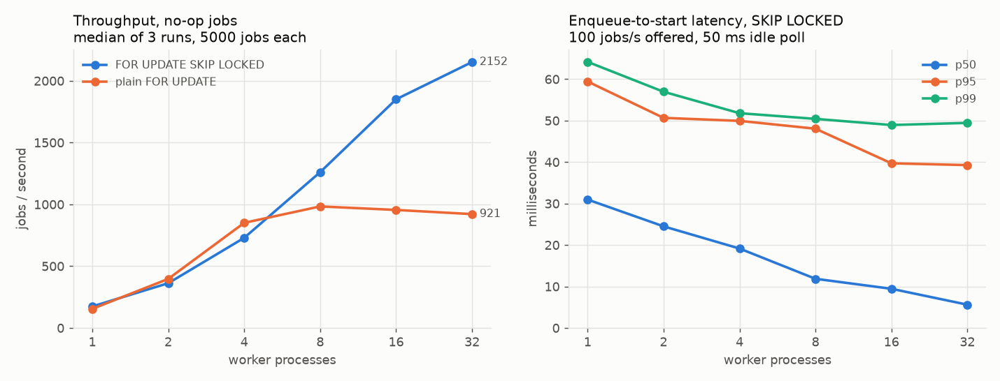
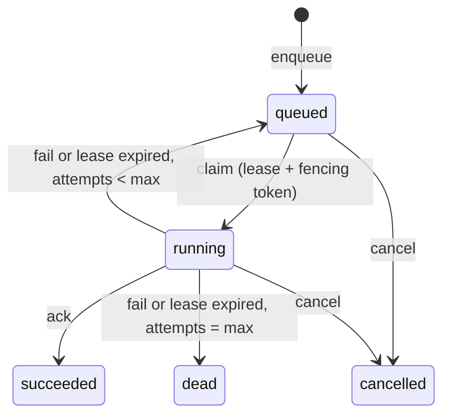

# pgqueue

A durable job queue built on a single PostgreSQL table, with a FastAPI HTTP API
for producers and a Python worker library. Producers enqueue jobs with a
priority, an optional delay and an optional idempotency key; workers claim jobs
with `SELECT ... FOR UPDATE SKIP LOCKED` plus a time-limited lease that a
heartbeat keeps alive, then ack or fail them. Failures retry with exponential
backoff and jitter and are dead-lettered after `max_attempts`; a reaper returns
jobs from crashed workers to the queue. I built it to understand what "durable"
and "at-least-once" mean in practice, so the repo includes a test that kills
workers mid-job, a test that restarts the database under load, and a benchmark
that shows why `SKIP LOCKED` matters.

## Results

All numbers below come from scripts in `bench/`; the raw output is in
[`results/`](results/).

**Hardware and setup.** Laptop with an Intel i9-14900HX (32 logical CPUs),
Windows 11, Python 3.13.7, PostgreSQL 18.4 embedded via `pixeltable-pgserver`
(default settings: `fsync=on`, `synchronous_commit=on`, `shared_buffers=128MB`),
database and workers on the same machine over TCP loopback. Other workloads
were running on the laptop at the same time, so absolute numbers are noisy; the
per-run spread is in `results/benchmark.json`. CI and docker-compose use
PostgreSQL 16.

### Throughput: SKIP LOCKED vs plain FOR UPDATE

`python -m bench.benchmark`: 5000 pre-loaded no-op jobs, N worker processes
released together from a barrier, rate measured from the first claim to the
last ack using database timestamps. Median of 3 runs.

| Worker processes | `FOR UPDATE SKIP LOCKED` (jobs/s) | plain `FOR UPDATE` (jobs/s) |
|---:|---:|---:|
| 1  | 173.9  | 154.2 |
| 2  | 361.9  | 396.7 |
| 4  | 729.1  | 850.4 |
| 8  | 1260.4 | 983.3 |
| 16 | 1850.2 | 954.9 |
| 32 | 2151.7 | 921.2 |



Up to 4 workers the two modes are within run-to-run noise (for 1 worker the
three SKIP LOCKED runs ranged 169 to 207 jobs/s). From 8 workers on, the plain
`FOR UPDATE` claim stops scaling at roughly 950 jobs/s while SKIP LOCKED keeps
climbing to about 2150 jobs/s at 32 workers. With a plain `FOR UPDATE`, every
claimer tries to lock the same head-of-queue row and waits until the holder's
claim transaction commits before moving on to the next row, so claims are
effectively serialized. SKIP LOCKED lets each claimer take the next unlocked
row immediately.

Each job costs two short transactions (claim, ack), each with a WAL flush, so
these numbers measure queue overhead, not a realistic workload.

### Enqueue-to-start latency

One producer enqueues 1000 jobs at a fixed 100 jobs/s; workers poll every
50 ms when idle. Latency is the claim time minus `run_at`, both read from the
database clock.

| Worker processes | p50 (ms) | p95 (ms) | p99 (ms) |
|---:|---:|---:|---:|
| 1  | 30.96 | 59.43 | 64.17 |
| 2  | 24.50 | 50.66 | 56.96 |
| 4  | 19.15 | 49.94 | 51.79 |
| 8  | 11.85 | 48.05 | 50.42 |
| 16 | 9.44  | 39.70 | 48.94 |
| 32 | 5.61  | 39.27 | 49.45 |

At this rate the workers are mostly idle, so latency comes mostly from the
50 ms poll interval (more workers means a new job waits less for the next poll).
The two claim modes give similar latency at this load (both are in the JSON).

### Crash safety (worker processes killed mid-job)

`python -m bench.crash`: 1000 jobs, 6 worker processes, lease 1 s. Every
0.3 s a random worker gets `SIGKILL` (`TerminateProcess` on Windows) and a
replacement starts. Each handler records a delivery row before doing its
10 to 50 ms of work.

| Metric | Value |
|---|---:|
| Workers killed | 30 (17 were holding a job at that moment) |
| Jobs succeeded | 1000 / 1000 |
| Jobs never delivered | 0 |
| Duplicate deliveries (handler ran more than once) | 17 (1.7%) |
| Most deliveries of one job | 2 |
| Failed attempts recorded (expired leases) | 18 |
| Wall time | 12.93 s |

No job was lost, and 17 jobs ran twice, which at-least-once delivery allows.
A smaller version of this test (150 jobs, 5 kills) runs in `pytest` and in CI.

### Database restart under load

`python -m bench.restart`: 500 jobs, 4 workers, lease 5 s. After 264 jobs had
succeeded and 4 were running, the server was restarted with
`pg_ctl restart -m fast` (disconnects all sessions and aborts open
transactions). The database accepted connections again 0.49 s after the
restart began, and all 500 jobs had succeeded 2.43 s after it began. There
were 0 duplicate deliveries and 4 failed attempts. The failures came from the
test handler, which records deliveries over its own plain connection: that
connection broke in the restart, so the first job each of the 4 workers ran
afterwards raised `OperationalError`, was recorded as a failed attempt, and was
retried. The workers' own queue calls did not fail, because the connection
pool waits (up to its 30 s timeout) for a new connection while the server is
down. CI runs the same test on every push against the Postgres service
container, restarted with `docker restart`.

## Guarantees and failure modes

- **Durability.** A job exists once `POST /jobs` returns: the response is sent
  after the INSERT commits. Every state change is a committed UPDATE, so
  anything acknowledged survives a crash or restart of PostgreSQL (with the
  default `fsync=on`, `synchronous_commit=on`).
- **At-least-once delivery, not exactly-once.** A job can run more than once:
  when a worker dies after its handler has side effects but before the ack
  commits, or when an ack cannot reach the database. Handlers with side
  effects should be idempotent (`job.id` works as a dedupe key).
- **No double ownership.** At any moment at most one worker holds a valid
  lease on a job. Each claim issues a new `lease_token`, and ack, fail and
  heartbeat only succeed if the token matches, so a worker whose lease was
  reaped cannot overwrite the result of the attempt that replaced it.
- **Ordering.** Claims go by `priority DESC, run_at, id`. That is best-effort
  ordering, not strict FIFO: concurrent workers finish in any order, and
  retries go back into the queue.

What happens when things break:

| Event | What happens |
|---|---|
| Worker process crashes or is killed | Its open transaction is rolled back by PostgreSQL. A job it had claimed stays `running` until the lease expires; the reaper (every worker runs it every 5 s by default) then puts it back to `queued` and counts a failed attempt. |
| Worker stalls (long GC pause, network partition) | Same as a crash once the lease expires. If the worker wakes up later, its ack is rejected by the fencing token and its result is discarded. |
| Handler raises | The attempt fails; the job is retried after `base * 2^(attempt-1)` seconds (capped), half fixed and half random jitter. |
| Job keeps failing, or keeps crashing its worker | After `max_attempts` failed attempts (handler errors and expired leases both count) it moves to `dead` and stays there. |
| Database restarts | Committed jobs are intact. Claims that were in flight roll back (the job stays `queued`). The pool checks connections on checkout, replaces dead ones, and makes callers wait up to 30 s for a new one. Errors that still surface (a connection dropped mid-query, or the pool timeout) make the worker back off, up to 10 s, and try again. If an ack is lost this way, the job stays `running` until its lease expires and then runs again. |
| Job cancelled while running | The job moves to `cancelled` and its lease is revoked. The handler keeps running (Python cannot interrupt it safely), but its ack is rejected and the job is not retried. |
| Two producers enqueue with the same idempotency key | One row is inserted; both calls get the same job (201 for the first, 200 for the duplicate). |

## Architecture

```
producers ── HTTP ──> FastAPI app (api.py) ──┐
                                             │   one SQL statement per state
worker processes (worker.py) ────────────────┤   transition (queue.py)
  claim -> run handler -> ack / fail         │
  heartbeat thread extends the lease         v
  reaper re-queues expired leases      PostgreSQL: jobs table
```



| Path | Contents |
|---|---|
| `src/pgqueue/migrations/001_create_jobs.sql` | Schema: jobs table, partial indexes for claiming and reaping, idempotency unique index |
| `src/pgqueue/queue.py` | `Queue`: enqueue, claim, heartbeat, ack, fail, cancel, reap, metrics queries |
| `src/pgqueue/worker.py` | `Worker`: poll loop, heartbeat thread, error handling |
| `src/pgqueue/api.py` | FastAPI app |
| `src/pgqueue/metrics.py` | Prometheus text rendering |
| `src/pgqueue/db.py` | SQL-file migration runner (advisory lock, one transaction per file) |
| `bench/` | Crash test, restart test, benchmark, plot, embedded-Postgres helper |

HTTP API:

| Method and path | Description |
|---|---|
| `POST /jobs` | Enqueue. Body: `task`, `payload`, `queue`, `priority`, `delay_seconds` or `run_at`, `idempotency_key`, `max_attempts`. 201 created, 200 if the idempotency key already exists. |
| `GET /jobs/{id}` | Job status, attempts, last error, result |
| `POST /jobs/{id}/cancel` | Cancel a queued or running job (409 if already finished) |
| `GET /metrics` | `pgqueue_jobs{queue,state}` gauge, `pgqueue_jobs_completed_total`, `pgqueue_job_failures_total`, `pgqueue_enqueue_to_start_seconds` histogram |
| `GET /healthz` | Database connectivity check |

## Quickstart

With Docker (PostgreSQL 16, the API, and two workers running `examples/tasks.py`):

```bash
docker compose up --build
curl -X POST localhost:8000/jobs -H 'content-type: application/json' \
     -d '{"task": "echo", "payload": {"hello": "world"}}'
curl localhost:8000/jobs/1
curl localhost:8000/metrics
```

Without Docker, using the embedded PostgreSQL from `pixeltable-pgserver`:

```bash
python -m venv .venv && source .venv/bin/activate    # Windows: .venv\Scripts\activate
pip install -e ".[dev,local]"
export DATABASE_URL=$(python -m bench.localdb)       # starts Postgres in ./.pgdata
python -m pgqueue api &                              # http://127.0.0.1:8000/docs
python -m pgqueue worker --handlers examples.tasks:HANDLERS
```

As a library:

```python
from pgqueue import Job, Queue, Worker, migrate

def send_email(job: Job) -> dict:
    ...  # must be idempotent: it can run more than once
    return {"sent": True}

migrate(url)
with Queue(url) as q:
    q.enqueue("send_email", {"to": "a@example.com"}, idempotency_key="welcome-42", priority=5)
    Worker(q, {"send_email": send_email}, lease_seconds=30).run()
```

## Reproduce

Tests and scripts use `DATABASE_URL` if it is set; otherwise they start the
embedded server in `./.pgdata`.

```bash
ruff check . && ruff format --check .
pytest                          # 53 tests, including a small crash test
python -m bench.crash           # -> results/crash_test.json
python -m bench.restart         # -> results/restart_test.json (embedded server only,
                                #    or pass --restart-cmd "docker restart <container>")
python -m bench.benchmark       # -> results/benchmark.json (about 15 minutes)
python -m bench.plot            # -> results/benchmark.png
```

## Design decisions

- **Short transactions plus a lease, instead of holding a row lock for the
  whole job.** Holding the lock would tie up one connection and one open
  transaction per running job (and long transactions hold back vacuum), and a
  worker that hangs while still connected would keep its job forever. With a
  lease, "the worker is gone" becomes a timestamp comparison the reaper can
  check.
- **A fencing token per claim.** The reaper can hand a job to a new worker
  while the old one is still running. Without the token, the old worker's late
  ack would overwrite the new attempt. `test_stale_worker_cannot_ack_after_its_lease_was_reaped`
  covers this.
- **Only the database clock.** `run_at`, leases and latency all use `now()`
  inside PostgreSQL, so clock skew between worker machines cannot make a
  lease look expired early.
- **An expired lease counts as a failed attempt.** Otherwise a job that
  crashes every worker that runs it (out-of-memory, segfault in a C extension)
  would be retried forever. With this rule it ends up `dead` after
  `max_attempts`.
- **Metrics computed with SQL at scrape time.** The API and the workers are
  separate processes (and may be replicated), so in-process counters would
  each see only part of the traffic. The table already holds the truth; the
  cost is an aggregate query per scrape (see Limitations).
- **Polling instead of LISTEN/NOTIFY.** It is simpler and needs no dedicated
  connection per worker. The cost is visible in the latency table: when the
  queue is idle, a new job waits for the next poll.

## Limitations

- Finished jobs are never deleted. There is no retention or archiving, and
  `/metrics` aggregates over the whole table, so scrapes get slower as the
  table grows. A production version would prune old rows and keep rollups.
- Idle latency is bounded by the poll interval (50 ms in the benchmark,
  500 ms by default). LISTEN/NOTIFY would reduce it; it is not implemented.
- There is no per-job execution timeout. A handler that hangs forever keeps
  heartbeating and holds its job. Cancelling a running job does not stop its
  handler.
- Jobs re-queued by the reaper are retried immediately, without backoff.
- `Worker` processes one job at a time. `Queue.claim(limit=...)` supports batch
  claims, but the worker does not use them.
- The HTTP API has no authentication.
- The benchmark uses no-op handlers on one shared laptop with the database on
  the same machine. It shows the relative behaviour of the two claim modes, not
  the throughput to expect on a dedicated server.

## License

MIT, copyright 2026 Yunlong Lu. See [LICENSE](LICENSE).
